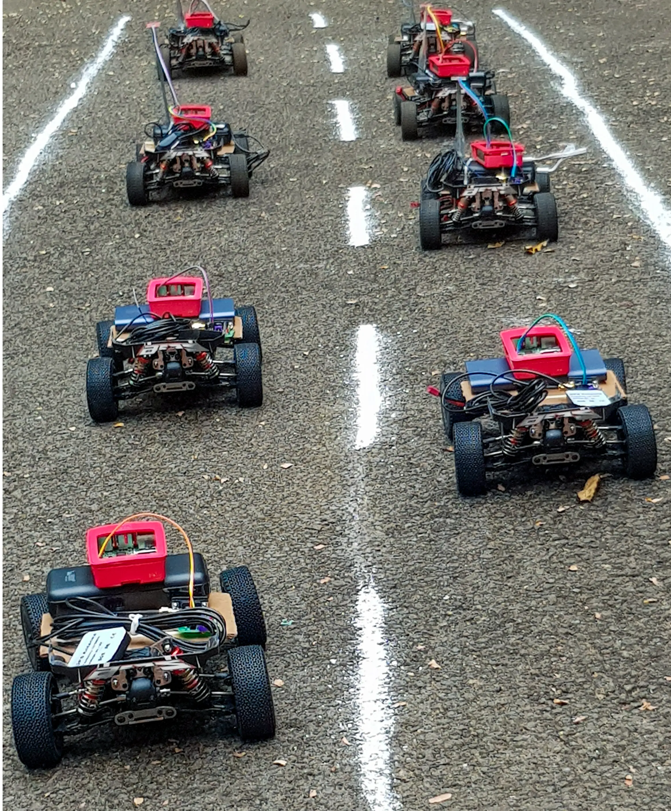
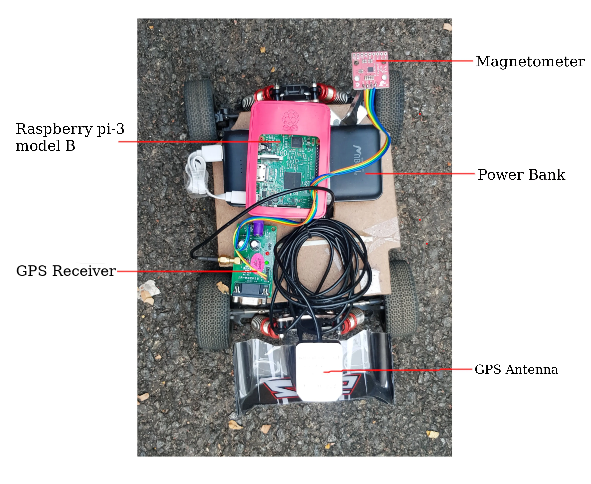
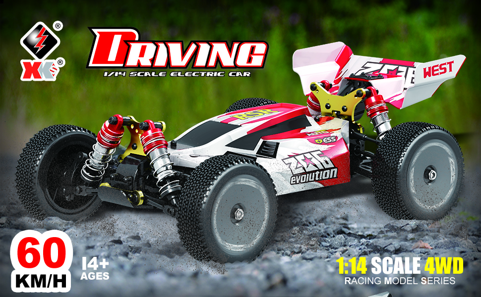

#CarTrac Testbed
The name of the funded VANET project is Collaborative Trusted Anony-mous Communication in Vehicular Networks (CARTRAC). The real implementation of VANET is expensive and requires more manpower. Conducting experiments in real roadtraffic is difficult and risky. 



Therefore, an ad hoc network was created, and experiments were conducted using low-cost Raspberry Pi devices mounted on RC cars. The low-cost testbed includes a Raspberry Pi model B device, a GPS module(antenna and receiver) for the position information, a magnetometer for retrieving the direction information, and ahigh-speed racing Remote Controlled (RC) car. The raspbian OS was installed on the raspberry pi. The GPS module and magnetometer are connected to the Raspberry Pi and configured as an OBU. The Raspberry Pi is configured in adhocmode and a power bank supplies power to the configured OBU. The OBU is mounted on the top of the RC car and stra-pped around it.



The high-speed racing RC cars (model 144001) were used for the experiments. RC cars moved up to a speed of 60 km/h and was used in the experiments. The remote controller works at 2.4 GHz and cansupport a length of 100 m. The car's body is made of high-strength aluminium alloy with strong stability, zinc alloy gears,and oil-pressure shock absorbers for strong wear resistance. Its high efficiency 550 strong magnetic motors support fastto and fro motion.




The testbed helps to implement and test the following:

* Routing protocols

* Synthetic mobility trace

* Security algorithm

* Security attacks

* Transport protocol

* Handover

* Clustering and creating platoons

* Safety message dissemination

```bash
Sarath Babu, and Arun Raj Kumar P. "A comprehensive survey on simulators, 
emulators, and testbeds for VANETs." International Journal of Communication
 Systems 35.8 (2022): e5123.
```