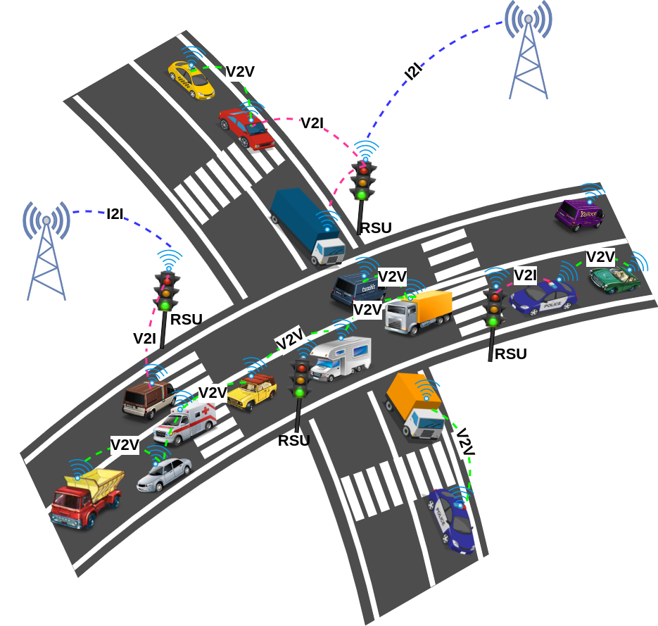

# Welcome to the Era of Connected Vehicles
Vehicular Ad Hoc Networks (VANETs) represent a specialized form of mobile ad hoc networks designed to enable communication between vehicles and infrastructure. In VANETs, vehicles equipped with wireless communication capabilities form a dynamic network, exchanging information to enhance road safety and traffic efficiency. Utilizing technologies like Dedicated Short Range Communication (DSRC), VANETs facilitate communication between vehicles and roadside infrastructure, enabling features such as collision avoidance, traffic management, and emergency response coordination. These networks play a pivotal role in the development of intelligent transportation systems, contributing to the evolution of connected and autonomous vehicles for safer and more efficient mobility.

click here [click here to view new.md](chapter_1/new.md)
## Commands

* `mkdocs new [dir-name]` - Create a new project.
* `mkdocs serve` - Start the live-reloading docs server.
* `mkdocs build` - Build the documentation site.
* `mkdocs -h` - Print help message and exit. Hello Ameen!

## Project layout

    mkdocs.yml    # The configuration file.
    docs/
        index.md  # The documentation homepage.
        ...       # Other markdown pages, images and other files.
