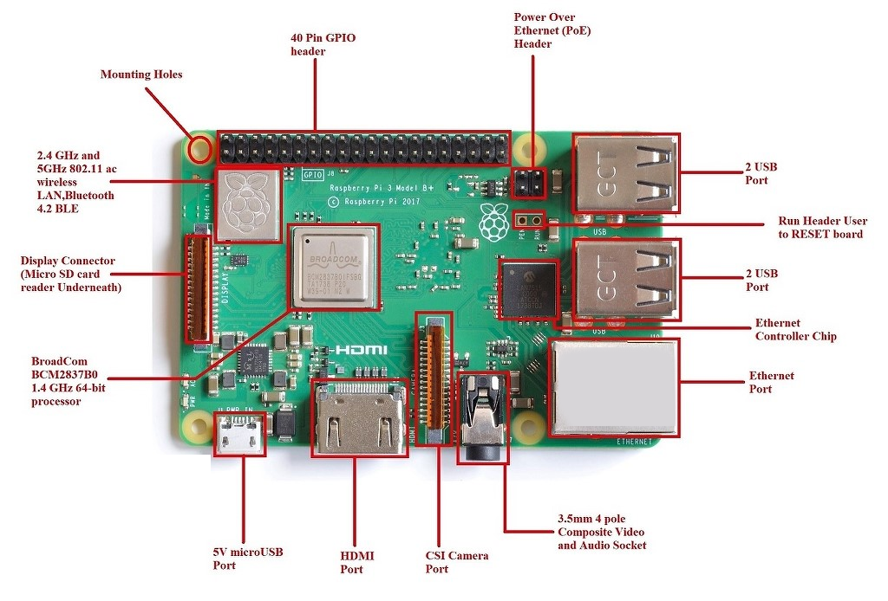

# Familiarization to raspberry pi
Raspberry Pi is a credit card-sized, single-board computer developed by the Raspberry Pi Foundation. Launched with the primary goal of promoting computer science education and fostering DIY projects, the Raspberry Pi has gained widespread popularity for its versatility and affordability. Powered by a Broadcom system-on-a-chip (SoC), it provides a fully functional computer with USB ports, HDMI output, GPIO (General Purpose Input/Output) pins, and networking capabilities. Despite its compact size and modest cost, the Raspberry Pi can run a variety of operating systems, making it an ideal platform for educational purposes, home automation, media centers, and numerous other applications. Its accessibility has fueled a vibrant community of enthusiasts, developers, and educators who continually explore innovative uses for this small yet powerful computing device.



## Software and Installation

Raspberry Pi OS, formerly known as Raspbian, is the official operating system designed for the Raspberry Pi single-board computers. It is a Debian-based Linux distribution tailored specifically for the Raspberry Pi's ARM architecture. The OS provides a user-friendly environment and comes with essential software tools, including a web browser, office suite, and programming environments. Its lightweight nature makes it well-suited for the limited resources of the Raspberry Pi hardware. Raspberry Pi OS supports a variety of applications and is widely used for educational purposes, DIY projects, and as a platform for learning programming and computing skills. Its modular design allows users to customize and expand their systems according to their specific needs, making it a versatile choice for a range of projects and applications.

* Raspberry Pi Imager is the quick and easy way to install OS in memorycard.
* Install Imager into system (https://www.raspberrypi.com/software/)
    - To install Imager on **Ubuntu**
        + Open Terminal

        ```bash
        sudo apt install rpi-imager
        ```
    - To install Imager on Windows[a link with target attribute](https://www.raspberrypi.com/software/){:target="_blank"}.

               
        