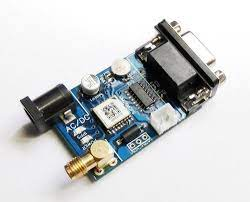
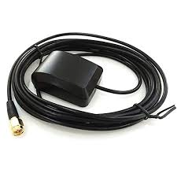

# Sensor Connection
Connecting sensors to a Raspberry Pi involves establishing a communication interface between the sensor and the GPIO (General Purpose Input/Output) pins on the Raspberry Pi board. Sensors, which capture physical data such as temperature, light, or motion, often have specific pin requirements and communication protocols. Users need to identify and configure the GPIO pins appropriately, ensuring compatibility with the sensor's specifications. Additionally, software libraries or drivers may be necessary to facilitate communication between the Raspberry Pi and the sensor. This integration allows the Raspberry Pi to collect data from the sensor, opening up possibilities for diverse applications, ranging from environmental monitoring to home automation.

## GPS Sensor
A GPS (Global Positioning System) sensor is a device designed to determine and track the precise geographical location of an object or individual by receiving signals from a network of satellites orbiting the Earth. The working principle of a GPS sensor involves triangulation, where signals from at least three satellites are used to calculate the user's exact position in three-dimensional space. The sensor receives signals from these satellites, each transmitting information about its location and the precise time of signal transmission. By measuring the time it takes for signals to travel from the satellites to the GPS receiver, the sensor can determine the distance from each satellite. With information from multiple satellites, the GPS sensor can then calculate the user's latitude, longitude, and altitude. GPS sensors have become integral in various applications, including navigation systems, mapping, outdoor activities, and asset tracking, providing accurate and real-time location data.

## How GPS Works

The GPS receiver uses a constellation of satellites and ground stations to calculate accurate location wherever it is located. These GPS satellites transmit information signals over radio frequency (1.1 to 1.5 GHz) to the receiver. With the help of this received information, a ground station or GPS module can compute its position and time.

## How GPS Receiver Calculates its Position and Time
GPS receiver receives information signals from GPS satellites and calculates its distance from satellites. This is done by measuring the time required for the signal to travel from the satellite to the receiver.

Distance = Speed x Time
Where,

Speed = Speed of Radio signal which is approximately equal to the speed of light. 

Time = Time required for a signal to travel from the satellite to the receiver.

By subtracting the sent time from the received time, we can determine the travel time.

To determine distance, both the satellite and GPS receiver generate the same pseudocode signal at the same time.

The satellite transmits the pseudocode; which is received by the GPS receiver.
These two signals are compared and the difference between the signals is the travel time.
Now, if the receiver knows the distance from 3 or more satellites and their location (which is sent by the satellites), then it can calculate its location by using the Trilateration method.
